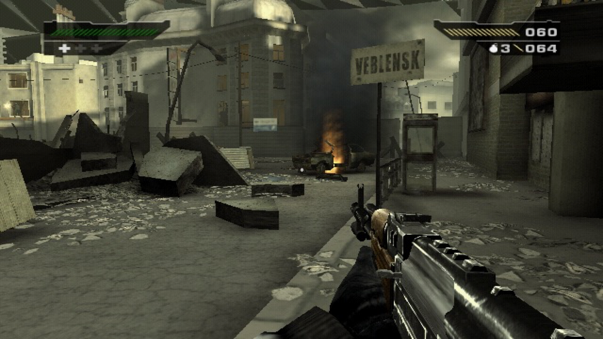

# black-recomp



Veblensk rodando nativo no Mac.

## O que é

Isso aqui é uma tentativa de rodar o **Black** (PS2, EA/Criterion) nativo no Mac, sem emulador.

A ideia é recompilar o código do jogo pra ARM64 usando o [PS2Recomp](https://github.com/ran-j/PS2Recomp) do ran-j. O resto (gráficos, vídeo, som, controle) fica por conta do runtime do PS2Recomp, com um monte de correções minhas.

Só funciona no macOS com Apple Silicon (testei num M1 Pro).

**Não tem nenhum arquivo do jogo aqui.** Nada de ISO, ELF, BIOS, textura, microcódigo ou código gerado a partir do jogo. Pra rodar você precisa da sua própria cópia do Black. Os scripts não usam BIOS, só os arquivos do seu disco.

## Até onde chegou

- O jogo abre, passa pelo menu, toca os vídeos e chega na primeira fase (Level_00). Já dá pra andar pelas ruas de Veblensk (a foto aí em cima).
- **A sala do começo tá inteira.** As paredes, o teto e as janelas que sumiam eram o VF0 zerado nas threads secundárias. Corrigido, e o jogador não fica mais preso.
- **Geometria que sumia conforme a câmera também foi resolvida.** Era o arredondamento do EE (o PS2 trunca) e uns stalls de pipeline da VU que faltavam.
- **Nada do console é interpretado no caminho normal:** EE, VU0, VU1 e IOP rodam recompilados.
- **A VU1 já é mais rápida que a do PS2.** Os microprogramas viram blocos NEON nativos (~95% dos pares de instrução rodam assim). No replay de traces gravados do jogo dá ~2,2–2,3 ns por par, contra ~3,4 ns no chip de verdade, ou seja, ~1,5× mais rápida que o console, com 0 divergências contra a referência.
- A VU0 usa o mesmo esquema e caiu pra ~5–7 ns por par. Ainda é mais lenta que o hardware, mas é só uns 8% da thread do jogo.
- O microcódigo da VU sai direto do seu ELF na hora do build. Nada disso vem no repo.
- **60 fps tá perto.** Com `BLACK_TICK_RATE=60` (experimental, desligado por padrão) o jogo roda a 60 atualizações por segundo. No percurso do Level_00 fica em 56–60 a maior parte do tempo. A 30 fica cravado em 30.
- O que ajudou a chegar aí: espera do vblank sem gastar CPU, UNPACK do VIF1 mais rápido, 8 contextos de quadro no Granite (paraLLEl-GS) e as otimizações da VU.
- **Num ponto bem pesado** (olhando pela janela, ~117 mil primitivos por quadro) cai pra ~36 a 60 ticks. Ali quem segura agora é o GS (paraLLEl-GS montando primitivos), não a VU.
- **Renderizador nativo em Metal começando** (`gpu/native/`). Já desenha a cena, mas a imagem final ainda sai errada. Não é o padrão; o launcher continua no paraLLEl-GS.
- 16:9 com `BLACK_WIDESCREEN=1`. Dá pra pular vídeo com Tab ou Select. Teclado e controle funcionam (veja [CONTROLES.md](CONTROLES.md)).

## O que falta

Ainda não dá pra jogar de verdade.

- **Travamento raro:** duas vezes o jogo congelou num `qsort` da fila de desenho (o cabeçalho de um balde é sobrescrito por algo). Não consegui reproduzir ainda.
- Chão liso ou com buracos perto da porta da sala inicial. Ainda investigando.
- Às vezes uma abertura de arquivo falha sem motivo (parece corrida entre threads).
- Alta resolução (`PS2X_GS_UPSCALE`) ainda sai com defeito.
- Só testei o começo do jogo (Level_00 / Veblensk).

## Próximos passos

- Terminar o renderizador Metal do GS, que agora é o gargalo.
- VU de "alto nível" de verdade: resolver o timing na hora de gerar o código, uma função por microprograma e cobrir o resto dos pares. Isso inclui melhorar a VU0.
- Dividir o VIF1/VU1 em mais threads (pra 120 fps).
- Testar o jogo inteiro.
- Um `setup.sh` pra montar tudo de uma vez.

Os detalhes técnicos de verdade estão em [PS2_PROJECT_STATE.md](PS2_PROJECT_STATE.md).

> **Aviso:** parte do que tá descrito aqui (blocos NEON da VU, overrides de 60 ticks, espera do vblank, renderizador Metal) ainda tá só na minha máquina e não foi pro repo. O código e o patch daqui são do último push.

## Como rodar

Os scripts esperam esse repo numa pasta `ps2recomp/`, ao lado do PS2Recomp e dos seus arquivos do jogo:

```
pasta/
├── ps2recomp/          # esse repo
├── tools/PS2Recomp/    # PS2Recomp no commit 75d729c
├── orig/SLUS_213.76    # ELF do seu disco
├── orig/Black.iso      # ISO do seu disco
└── recomp/disc/        # arquivos extraídos do seu disco
```

1. Clona esse repo: `git clone https://github.com/SirBraga/black-recomp.git ps2recomp`
2. Clona o PS2Recomp, volta pro commit certo e aplica o patch:
   ```sh
   git clone https://github.com/ran-j/PS2Recomp.git tools/PS2Recomp
   git -C tools/PS2Recomp checkout 75d729c
   git -C tools/PS2Recomp apply ../../ps2recomp/patches/PS2Recomp-local-changes.patch
   ```
3. Coloca os arquivos do seu disco em `orig/` e `recomp/disc/`. Vai precisar de CMake, Ninja (em `.venv/bin/ninja`), Python 3 e SDL3 (Homebrew).
4. Compila o jogo: `ps2recomp/build.sh`
5. Gera a VU a partir do seu ELF: `ps2recomp/build_vu_recompiled.sh` (demora uns 20 min)
6. Opcional: `ps2recomp/gpu/build.sh` pro paraLLEl-GS (precisa do MoltenVK em `recomp/gpu/moltenvk/`)
7. Joga: abre o `ps2recomp/JogarBlack.command`
8. Depois da primeira vez, roda `ps2recomp/build_iop_recompiled.sh` pra recompilar o IOP com os módulos que o launcher salvou

## Créditos

- [PS2Recomp](https://github.com/ran-j/PS2Recomp), do ran-j e contribuidores. Tudo aqui é em cima dele, e o patch segue a licença dele (GPL-3.0).
- SDL3, Raylib, Dear ImGui, rlImGui, FFmpeg, paraLLEl-GS e MoltenVK.
- PCSX2 e RT64 como referência.

Black é marca da Electronic Arts. Projeto independente, sem ligação com a EA ou a Criterion.
